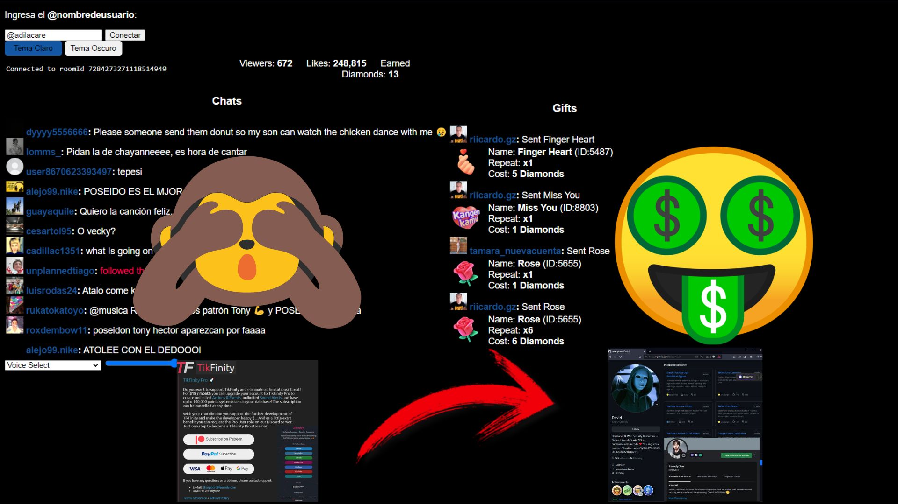

## TiktokLiveApp
¡WebApp TiktokLIVE! herramienta para tiktok live interactivo
# Instalacion
Para instalar la version estable, deber ir a descargar el archivo.zip o el ejecutable EN RELEASES

LEER O REVISAR DOCUMENTACION.
[nglmercer.github.io/TikLiveApp](https://nglmercer.github.io/TikLiveApp/)
1. Speechchat voice chat(el bot lee tus mensajes)
2. SoundAlerts (tiene soporte de alertas de audios y videos)
3. twitch Crossover (puedes conectar tus comandos y el chat de twitch)
4. MixitupApp API support (conecta mixitupApp para usar todas las herramientas)
5. Minecraft interactive Bot (crea un bot para que envie los comandos que configures )
6. VRChat chatbox support (envia los mensajes al chatbox para leerlo o mostrarlo en el juego)

# tiktokMIXPLUGIN GITHUB 

**SOUND ALERT and command-action TikTok plugin for MixItUpApp** // Sonidos de alerta, comandos y acciones de TikTok conectados a MixItUpApp

## CÓMO USAR

1. **Descargar Todo en un Archivo ZIP**: Comienza por descargar todos los archivos necesarios en un archivo ZIP.

2. **Modificar el Código o Revisarlo**: Puedes modificar el código según tus necesidades o simplemente revisarlo para asegurarte de que cumple con tus requisitos.

3. **Ejecutar INDEX.HTML**: Ejecuta el archivo INDEX.HTML para iniciar el plugin.

4. **Ingresar @USERNAME y Conectar**: Ingresa tu @USERNAME y establece la conexión.

5. **Descargar MixItUpApp**: Descarga MixItUpApp desde su sitio web oficial.

6. **Conectar MixItUpApp a tu Transmisión y Configurarlo**: Vincula MixItUpApp a tu transmisión y configúralo según sea necesario.

7. **Verificar la Funcionalidad y Disfrutar**: Verifica si todo funciona correctamente y disfruta del plugin.

## ACERCA DE

Este plugin es una página web que envía mensajes al chat de YouTube o Twitch utilizando MixItUpApp con una API de localhost.

Los mensajes recibidos se utilizan como palabras clave para comandos y otras herramientas de Twitch.

Ejemplo: Si se envía un mensaje como "donación 1 Rose", aparecerá como "Rose" en el chat. Puedes configurar un sonido para reproducirse cada vez que se mencione o escuche "Rose".

Además, con TwitchSpawn, puedes crear comandos, mensajes y diversos eventos interactivos para Minecraft.

SongRequest te permite poner en cola solicitudes de música, que se pueden reproducir utilizando Nightbot o Streamlabs. Consulta tutoriales para un funcionamiento perfecto.

## Instalación OVERLAY OBS
solo ejecute index.html o sige lo siguiente 

Para ejecutar el lector de chat localmente, sigue estos pasos:

1. **Instalar [Node.js](https://nodejs.org/) en tu sistema.

2. **Clonar este repositorio o descargar y extraer [este archivo ZIP](https://github.com/zerodytrash/TikTok-Chat-Reader/archive/refs/heads/main.zip).

3. **Abrir una consola/terminal en el directorio raíz del proyecto.

4. **Ejecutar `npm i` para instalar todas las dependencias requeridas.

5. **Ejecutar `node server.js` para iniciar el servidor de la aplicación. server.bat hace este comando 

Ahora deberías ver el siguiente mensaje: `Server running! Please visit http://localhost:8091` 
Simplemente abre http://localhost:8081/ en tu navegador. Eso es todo.

Si tienes problemas con Node.js, también puedes abrir el `index.html` desde la carpeta `public`. 
Esto utilizará el servidor backend del [sitio de demostración](https://tiktok-chat-reader.zerody.one/), que es suficiente para fines de prueba. Si deseas ofrecerlo a otros o realizar muchas conexiones al mismo tiempo, considera usar tu propio servidor.

## Captura de pantalla
antiguo

 
nuevo 

---

  

